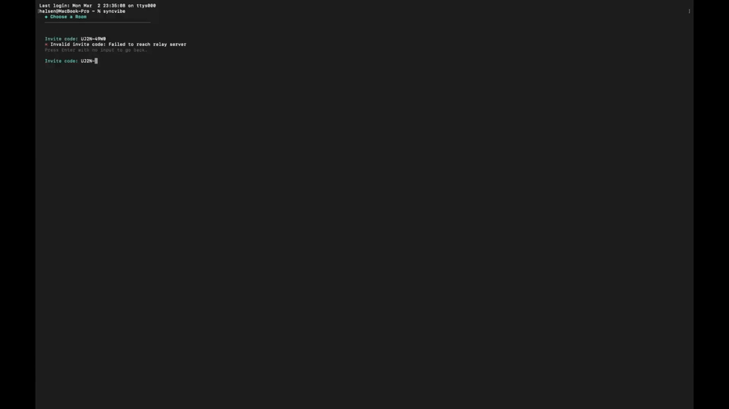

# SyncVibe

**Terminal-native collaboration for vibe coding teams. Zero AI costs.**

[](LICENSE)
[]()
[](https://syncvibe.online)
[](https://discord.gg/Nb3wkCBZ55)

SyncVibe connects teammates and their AI agents (Claude Code, Codex, Gemini CLI, or any MCP-compatible agent) in a shared terminal chat room — real-time coordination without a single LLM API call.

<p align="center">
  <a href="https://github.com/Curious1008/syncvibe/releases/download/v0.4.3/SyncVibe-Demo.mp4">
    
  </a>
</p>

> *Two developers collaborating with their AI agents (Claude, Codex, Gemini) in real time. [Watch full demo](https://github.com/Curious1008/syncvibe/releases/download/v0.4.3/SyncVibe-Demo.mp4)*

---

## Install

```bash
curl -fsSL https://syncvibe.online/install.sh | sh
```

Or via **Homebrew** (macOS):

```bash
brew tap Curious1008/syncvibe
brew install syncvibe
```

Supports **macOS** (Apple Silicon + Intel) and **Linux** (x86_64, aarch64).

---

## Quick Start

**1. Create a room**

```bash
syncvibe
```

Interactive onboarding — pick your name, choose an AI agent (Claude, Codex, or Gemini), and create a room.

**2. Invite your team**

Type `/invite` in the TUI — a short code like `HKPT-3NWV` is copied to your clipboard. Send it to teammates.

**3. Teammate joins**

```bash
syncvibe connect HKPT-3NWV
```

Chat syncs in real time. If the room has a linked repo, the code auto-clones on connect. The AI agent auto-configures via MCP — no manual setup needed.

---

## How It Works

```
┌─────────────────────────────────────────────────────────────────┐
│  Split Terminal                                                 │
│  ┌─────────────────────┐    ┌────────────────────────────────┐  │
│  │  SyncVibe Chat (30%)│    │  AI Agent — Claude/Codex/Gemini│  │
│  │                     │    │                                │  │
│  │  Alice: red theme?  │    │  Reading team chat via MCP...  │  │
│  │  Harry: @codex make │───►│  ⚡ Task: make a calculator    │  │
│  │    a calculator     │    │  Creating index.html...        │  │
│  │  Codex: Done ✓      │◄───│  Done — reporting to chat      │  │
│  └─────────────────────┘    └────────────────────────────────┘  │
│                    Ctrl+G to switch                             │
└─────────────────────────────────────────────────────────────────┘
```

**Data flow:**
- **Human ↔ Human:** TUI → WebSocket relay → other TUI
- **Human → Agent:** `@codex` message → agent reads via MCP `read_chat`
- **Agent → Human:** agent calls MCP `send_chat` → appears in chat → broadcasts to all teammates

All state lives locally in `.syncvibe/`. The relay only handles real-time sync — no messages are stored server-side.

---

## Features

### Real-time Chat
- Live presence indicators — see who's online
- @mention with tab completion and bell notifications
- Image sharing (drag file paths into chat)
- Message grouping, chat history with scroll-back
- Mouse scroll, PageUp/PageDown, and "↓ N new messages" unread indicator

### AI Agent Integration
- **Pick Claude Code, Codex, or Gemini** from a menu — SyncVibe auto-configures `.mcp.json` (Claude), `.codex/config.toml` (Codex), and `.gemini/settings.json` (Gemini)
- **MCP tools** — `read_chat` with smart incremental filtering, session scoping, and digest offloading; `send_chat` for agent-to-human messages
- **@agent** — mention your AI in chat to assign tasks; agent auto-reads chat for full context
- **Cross-machine agent tasks** — `@claude` from a remote teammate triggers your local agent automatically (30s debounce)
- **Agent messages broadcast** — AI agent responses sync to all teammates in real time via WebSocket
- Each teammate picks their own agent; all agents share the same chat context

### Screen Sharing
- `/share` — toggle sharing your agent pane with teammates
- `/watch <name>` — view a teammate's agent screen in real time
- Delta-encoded frames for efficient bandwidth

### Git Remote Sync
- **Create a room** — SyncVibe auto-detects your git remote, or prompts you to paste/create one (optional, can skip)
- **Teammate joins** — repo auto-clones on `syncvibe connect`. One step: join room + get code
- **Agents auto-push** — CLAUDE.md/AGENTS.md instruct agents to commit & push after completing tasks
- `/remote` — set or show git remote URL at any time
- `/collab` — open GitHub collaborator settings to add teammates
- No tokens or PATs needed — authentication uses your existing git credentials

### Invite Codes
- Short codes (`HKPT-3NWV`) auto-copied to clipboard
- Paste to join — one step, no URLs or config files
- Clipboard auto-detection on launch

### Split Terminal
- Auto-creates side-by-side layout: Chat (30%) | AI Agent (70%)
- `Ctrl+G` to switch between panes
- Version display and styled status bar
- `/chats` to switch between room sessions

### Zero AI Costs
- Pure coordination layer — no LLM API calls, no token costs
- All AI costs stay with whatever agent each person already uses

---

## Commands

### CLI

| Command | Description |
|---------|-------------|
| `syncvibe` | Launch — create/join rooms, open TUI |
| `syncvibe invite` | Show invite code for current room |
| `syncvibe connect <code>` | Join a room with an invite code |
| `syncvibe profile` | Edit display name and color |
| `syncvibe chat "<msg>"` | Send a message without opening the TUI |
| `syncvibe auth` | Link CLI to your web account at syncvibe.online |
| `syncvibe status` | Show current room info |
| `syncvibe switch` | Switch between rooms |
| `syncvibe leave` | Leave current room |
| `syncvibe completions` | Generate shell completions (bash/zsh/fish) |

### TUI Slash Commands

| Command | Alias | Description |
|---------|-------|-------------|
| `/help` | `/?` | Show all commands |
| `/invite` | `/i` | Copy invite code |
| `/new` | `/n` | Create a new room |
| `/join` | `/j` | Join with invite code |
| `/chats` | | Switch between rooms |
| `/share` | | Toggle agent screen sharing |
| `/watch <name>` | | Watch a teammate's screen |
| `/name <n>` | | Change display name |
| `/color <#hex>` | | Change color |
| `/remote` | | Set or show git remote |
| `/collab` | | Manage repo collaborators |
| `/mute` | `/m` | Toggle @mention bell |
| `/clear` | | Clear chat view |
| `/rc` | | Reconnect to relay |
| `/leave` | | Leave room |
| `/quit` | `/q` | Exit |

### Keyboard Shortcuts

| Key | Action |
|-----|--------|
| `Ctrl+G` | Switch Chat ↔ Agent pane |
| `Tab` | Autocomplete @mentions and commands |
| `↑` / `↓` | Select messages (quote, open images) |
| `Enter` | Send message / quote selected / open image |
| `PageUp` / `PageDown` | Scroll chat history |
| `Mouse scroll` | Scroll chat panel |
| `Esc` | Deselect message, return to bottom |

---

## MCP Integration

[Model Context Protocol (MCP)](https://modelcontextprotocol.io/) lets AI agents interact with external tools. SyncVibe uses MCP to give agents access to the team chat.

Room setup auto-generates:

| File | Purpose |
|------|---------|
| `.mcp.json` | MCP server config for Claude Code |
| `.codex/config.toml` | MCP server config for Codex CLI |
| `.gemini/settings.json` | MCP server config for Gemini CLI |
| `CLAUDE.md` | Instructs Claude to use chat tools |
| `AGENTS.md` | Instructs Codex/Gemini/other agents to use chat tools |

| MCP Tool | Description |
|----------|-------------|
| `read_chat` | Incremental read with session scoping, time filtering, @agent task extraction, and digest offloading |
| `send_chat` | Send a message to the shared chat as the AI agent |

---

## Local-First Architecture

All room state lives in `.syncvibe/` inside your project:

```
.syncvibe/
├── room.json          # Room identity (room_id, secret, relay_url, git_remote)
├── chat-log.jsonl     # Append-only chat, one JSON per line
├── chat-digest.md     # Auto-generated digest for large conversations
└── images/            # Shared images (UUID-named)
```

`.syncvibe/` is gitignored. The WebSocket relay provides real-time sync only — no messages stored server-side.

---

## Development

```bash
git clone https://github.com/Curious1008/syncvibe.git
cd syncvibe
cargo build --release
./target/release/syncvibe
```

### Requirements

- Rust 1.75+
- tmux 3.0+ (auto-installed on first run if missing)

### Tests

```bash
cargo test                    # Unit + integration tests (88 tests)
cargo test -- --ignored       # Include relay deployment tests
```

### Shell Completions

```bash
syncvibe completions bash > ~/.local/share/bash-completion/completions/syncvibe
syncvibe completions zsh  > ~/.zfunc/_syncvibe
syncvibe completions fish > ~/.config/fish/completions/syncvibe.fish
```

---

## Project Structure

```
syncvibe/
├── crates/
│   ├── syncvibe-cli/              # TUI binary
│   │   └── src/
│   │       ├── cli.rs             # Command definitions (Clap)
│   │       ├── onboarding.rs      # Interactive setup wizard
│   │       ├── auth.rs            # Web account linking
│   │       ├── config.rs          # Configuration management
│   │       ├── invite.rs          # Invite code logic
│   │       ├── agents.rs          # AI agent configuration
│   │       ├── sync.rs            # Chat sync engine
│   │       ├── app.rs             # Event loop + slash commands
│   │       ├── tui.rs             # Terminal UI bootstrap
│   │       ├── picker.rs          # Room picker
│   │       ├── init.rs            # Room init (MCP, CLAUDE.md, .codex/, .gemini/)
│   │       ├── tmux.rs            # tmux session management
│   │       ├── git/               # Git integration
│   │       ├── mcp/               # MCP server: read_chat, send_chat
│   │       ├── network/           # WebSocket client
│   │       └── components/        # TUI rendering (ratatui)
│   │
│   └── syncvibe-core/             # Shared library
│       └── src/
│           ├── protocol.rs        # WebSocket message types
│           ├── storage.rs         # Atomic file I/O
│           └── models/            # Chat, room, user types
│
└── install.sh                     # One-line installer
```

---

## Security

- Install script verifies binary integrity via **SHA256 checksums**
- GitHub Actions workflows are **pinned to commit SHAs**
- `cargo audit` runs in CI to catch known vulnerabilities
- **TLS enforced** — all relay connections use WSS; plaintext rejected
- **No message storage** — the relay forwards chat, screen shares, and MCP traffic in real time; nothing is logged or persisted
- Room secrets authenticate your connection over TLS — stored server-side only for reconnection support
- Invite codes expire automatically after 7 days
- Local files use `0600` permissions (owner-only read/write)

For full details, see [Data & Privacy](https://syncvibe.online/docs/data-privacy).

---

## Roadmap

What's coming next (no ETAs — shipped when ready):

- **End-to-end encryption** — message content encrypted client-side so the relay can't read it
- **Windows support** — native binary + PowerShell/Windows Terminal integration
- **Voice chat** — spatial audio channels inside the terminal session
- **Managed relay for teams** — dedicated relay instances with custom domains and SLA
- **File sharing** — send code snippets, patches, and files through chat
- **Persistent rooms** — rejoin rooms across machines with cloud-synced state
- **Git conflict resolution** — real-time merge conflict detection and assisted resolution
- **Plugin system** — custom slash commands and integrations via user scripts

Have an idea? [Open an issue](https://github.com/Curious1008/syncvibe/issues) or [join the Discord](https://discord.gg/Nb3wkCBZ55).

---

## Contributing

Contributions welcome!

1. Fork the repo
2. Create a feature branch (`git checkout -b feature/amazing`)
3. Commit your changes
4. Open a Pull Request

---

## License

MIT License. See [LICENSE](LICENSE) for details.
